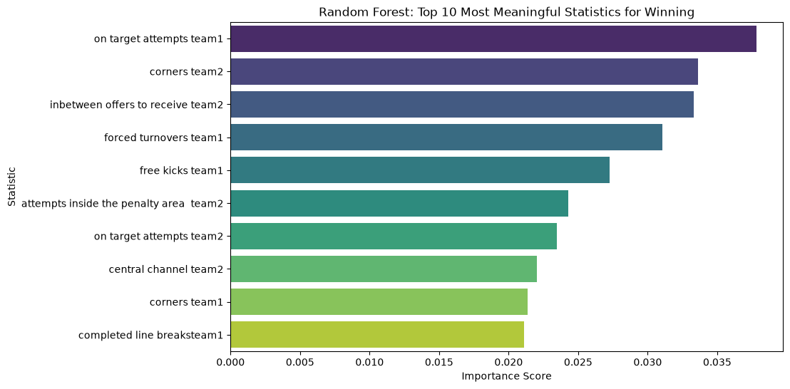

# 2022 World Cup Analytics: What Drives Winning?

### 1. Objective
The goal of this analysis was to identify the most meaningful in-game tactical statistics that correlate with winning football matches, using data from the 2022 FIFA World Cup.

### 2. Key Takeaways
After extensive exploratory data analysis and training a Random Forest Machine Learning model, three major insights emerged:
* **The Possession Myth:** Contrary to popular belief, ball possession does *not* positively correlate with winning. In fact, teams that lost averaged higher possession (45.9%) than teams that won (43.7%).
* **Accuracy over Volume:** Total shot volume is less important than accuracy. "On Target Attempts" had the strongest mathematical correlation (0.64) with scoring goals of any non-redundant statistic.
* **Purposeful Passing:** Just passing the ball is not enough. "Completed Line Breaks" and "Attempts inside the Penalty Area" heavily outweigh general passing stats, rewarding teams that aggressively push the ball forward.

### 3. Methodology
Data was cleaned and pre-processed to remove "leaky" variables (such as goals and assists) to ensure the analysis focused purely on underlying tactics. Relationships were verified using a Pearson Correlation Matrix, and feature importances were extracted from a Random Forest Classifier trained on the dataset.

### 4. Strategic Recommendations
Based on the data, coaching and training should prioritize:
1. **High-Intensity Pressing:** Winning teams averaged significantly higher defensive pressures.
2. **Shot Quality:** Prioritize drills that focus on finishing inside the penalty area over long-range volume shooting.
3. **Direct Attacking:** Tactics should favor vertical line-breaking passes over safe, lateral possession retention.

### 5. 10 Most Important Statistics for Winning
The following chart visualizes the top 10 most important features that contribute to a team's success, as determined by our Random Forest algorithm. 

In this dataset, **team 1** represents the team we are analyzing, and **team 2** represents their opponent. You will notice that statistics from *both* teams appear in the top 10. This highlights a crucial insight in football analytics: the game is highly interactive. For example, a metric like **corners team 2** appearing so high on the list indicates that the opponent's attacking pressure directly (and negatively) impacts Team 1's likelihood of winning.

To win a match, a team must not only excel in their own attacking efficiency (Team 1 stats) but must actively suppress their opponent's ability to generate set pieces and dangerous possession (Team 2 stats).

### 6. Looking Forward
While this analysis provides a strong foundational framework for understanding winning tactics, there are several avenues for future research to make these insights even more robust and actionable:
* **Expanding the Dataset:** The 2022 World Cup provides a relatively small sample size (64 matches) from a very specific, high-pressure tournament environment. Future iterations of this model should ingest domestic league data (e.g., English Premier League, La Liga) to train the algorithm on thousands of matches across a full season.
* **Player-Level Tracking:** Currently, the model evaluates team-aggregate performance. Integrating player-level spatial and tracking data would allow us to evaluate individual contributions to the team's tactical profile, aiding directly in scouting and recruitment.
* **Expected Goals (xG) Integration:** While "On Target Attempts" proved highly correlated with winning, raw shot volume does not account for shot difficulty. Future models should incorporate Expected Goals (xG) metrics to more accurately quantify the *quality* of chances created versus chances conceded.
* **Predicting the 2026 World Cup:** As the 2026 World Cup approaches with an expanded 48-team format, the tactical landscape will inevitably shift. This model serves as a baseline that can be continuously updated with international qualifying match data, ultimately allowing us to run tournament simulations and predict the 2026 World Cup winner.